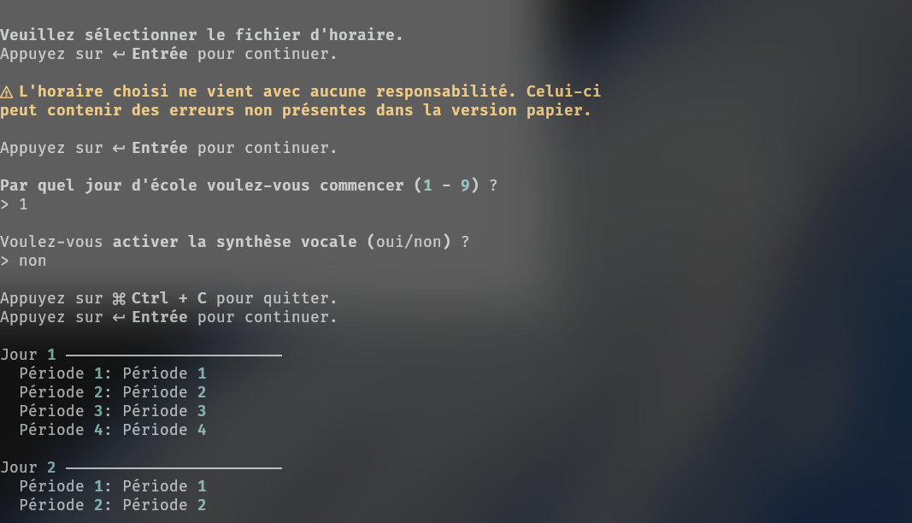

# Horaire
[](https://github.com/m3957/horaire/releases/latest)

Programme Python avec ces deux fonctions de paresseux:

1. **Générateur de fichier ICS**
	- Génère un fichier ICS importable dans une application de calendrier avec à l'intérieur les périodes pour la semaine.


2. **Copie de périodes dans l'agenda papier**
	- Liste les périodes une à la fois pour les recopier dans l'agenda.



## Installation
Le programme peut être téléchargé depuis [la page Releases](https://github.com/m3957/horaire/releases/latest) ou être exécuté manuellement.

### À partir de la page Releases
1. Télécharger le fichier dans le bas de [la page Releases](https://github.com/m3957/horaire/releases/latest)
2. Ouvrir le programme
3. Ignorer les plaintes de l'anti-virus
	- Bonnes chances que Windows chiale que le programme pourrait être un virus. Pas mon problème, même pas moi qui a fait le fichier exe, et le code est vérifiable. Mauvaise pratique? Probablement.
4. Cliquez sur un texte "En savoir plus".
5. Un bouton devrait apparaître permettant d'exécuter le programme quand même.
6. Cliquez sur le bouton "Exécuter quand même", priant pour ne pas avoir un virus (lol)

### À partir du fichier Python
1. Installer [Python](https://www.python.org/downloads/) et [git](https://git-scm.com/downloads)
2. Depuis un terminal, exécuter ces commandes

```bash
# Cloner le projet
git clone https://github.com/m3957/horaire

# Ouvrir le répertoire du projet
cd horaire

# Installer les dépendances
pip install -r requirements.txt

# Exécuter le programme
python3 main.py
```
